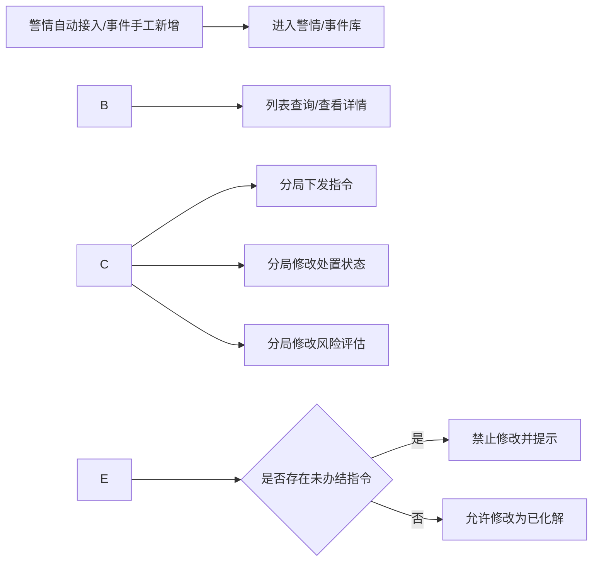
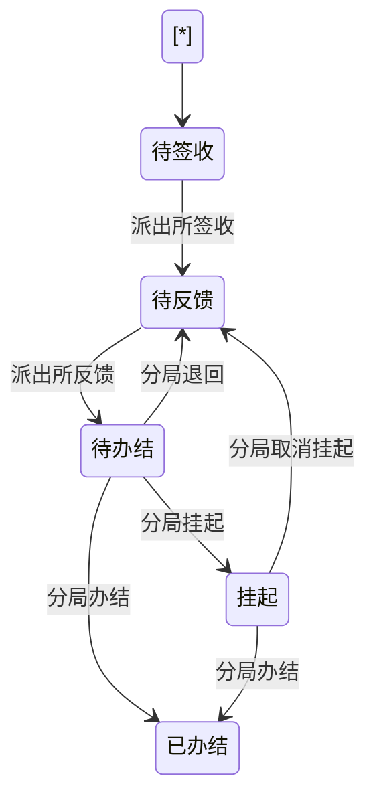

# 重点敏感警情事件与人员管理系统 PRD

## 1\. 文档概述

|项|内容|
|-|-|
|文档名称|重点敏感警情事件与人员管理系统 PRD|
|文档版本号|V1.0|
|编写日期|2026-04-22|
|编写人|glm5（依据现有需求文档与 Axure 原型整理）|
|适用对象|产品、后端开发、前端开发、测试、项目经理|

### 1.1 修改记录

|版本|日期|修改人|修改内容|
|-|-|-|-|
|V1.0|2026-04-22|Codex|基于需求文档与原型首版整理，可作为后端设计与开发输入|

## 2\. 产品背景

### 2.1 业务背景与现状问题

当前重点敏感警情、敏感事件、重点敏感人员、其他敏感人员数据分散在不同来源中，包括 110 报警、12345 热线、社区上报、散装汽油购买记录、司法纠纷记录等。现阶段存在以下问题：

* 数据来源分散，缺少统一汇聚与统一口径。
* 警情/事件处置过程缺少标准化闭环，指令下发、签收、反馈、办结链路不清晰。
* 分局与派出所权限边界不明确，存在跨辖区查看与越权操作风险。
* 已化解警情/事件缺少分层回访机制，无法确保业务真正闭环。
* 敏感人员识别与碰撞分析依赖人工，效率低、预警滞后。
* 操作留痕不足，不利于审计追责。

### 2.2 产品目标与价值

* 建立统一的重点敏感警情/事件、人员管理中台。
* 建立分局与派出所两级协同的指令闭环机制。
* 实现警情/事件与人员的自动汇聚、自动关联、自动碰撞。
* 形成“未化解处置闭环 + 已化解回访闭环”的全流程管理。
* 为后续统计分析、风险预警、督办考核提供标准化数据底座。

### 2.3 目标用户群体

* **分局用户**：拥有全量查看权限，负责指令下发、退回、挂起、取消挂起、办结、处置状态修改、风险评估修改、分局回访。
* **派出所用户**：仅可查看本辖区数据，负责签收、反馈、派出所回访、敏感投诉新增、导入外部数据。

### 2.4 预期收益

* 指令闭环效率提升，减少漏签收、漏反馈、漏办结。
* 提升重点人、重点事识别效率与时效性。
* 规范跨层级业务权限，降低误操作与越权风险。
* 为督办、考核、复盘提供全量操作日志和轨迹。

## 3\. 功能范围

### 3.1 功能清单

|编号|功能模块|优先级|说明|
|-|-|-|-|
|M01|首页工作台|P1|指标总览、类型分布、指令提醒、快捷跳转|
|M02|重点敏感警情/事件库|P0|警情/事件列表、筛选、导出、新增敏感事件、状态修改、风险评估、指令下发|
|M03|重点敏感人员库|P0|人员列表、详情、涉警/涉事查看、风险评估|
|M04|重点敏感指令盯办|P0|指令列表、签收、反馈、退回、挂起、取消挂起、办结、导出|
|M05|已化解警情/事件回访|P0|派出所回访、分局回访、回访记录查看、导出|
|M06|其他敏感人员库|P0|散装汽油/司法纠纷导入、详情查看、碰撞预警查看|
|M07|警情档案/事件档案|P1|详情档案、标签管理、指令记录、回访记录|
|M08|权限与组织边界|P0|分局/派出所权限隔离、辖区过滤|
|M09|操作日志与审计|P0|关键业务动作全量留痕|
|M10|数据汇聚与碰撞分析|P0|警情入库、人员生成、人员碰撞、预警库生成|

### 3.2 功能模块划分

* 业务管理域：M02、M03、M04、M05、M06、M07
* 数据治理域：M10
* 平台支撑域：M08、M09
* 展示与入口域：M01

### 3.3 本次迭代范围说明

本次迭代范围覆盖：

* 重点敏感警情/事件全生命周期管理。
* 重点敏感人员与其他敏感人员库管理。
* 指令闭环、回访闭环。
* 外部数据导入、自动碰撞、预警生成。
* 权限控制、日志审计、导出。

不在本次范围内：

* 独立组织/用户管理后台页面。
* 消息推送中心、短信/IM 通知。
* 字段级加密能力。**本项目明确不对任何字段做加密处理**，仅通过权限控制、脱敏展示策略和日志约束保障安全。

## 4\. 详细功能需求

### 4.1 M01 首页工作台

|项|说明|
|-|-|
|功能编号|M01|
|功能名称|首页工作台|
|功能描述|展示重点敏感警情/事件数、人员数、指令状态、回访情况、类型分布，并作为业务入口跳转到对应列表页|
|用户故事|作为分局/派出所用户，我希望进入系统后第一时间看到当前待办、风险态势和快捷入口|
|前置条件|用户已登录，拥有分局或派出所角色|
|原型引用|`首页.html`|

#### 操作流程

流程图描述：登录系统 -> 加载辖区范围数据 -> 展示指标卡片/图表 -> 点击数字或模块 -> 跳转对应业务页面。

#### 业务规则

* 分局用户看到全量汇总数据；派出所用户仅看到本辖区汇总数据。
* 首页提醒区至少展示：待签收指令数、待反馈指令数、待办结/待处理指令数。
* 点击首页数字卡片需按预设条件跳转：

  * 重点敏感警情/事件数 -> M02 默认列表
  * 未化解警情/事件数 -> M02 且筛选 `处置状态=未化解`
  * 已化解警情/事件数 -> M05 默认列表
  * 重点敏感人员数 -> M03 默认列表
  * 其他敏感人员库 -> M06 默认列表
* 图表统计按用户数据权限实时计算。

#### 异常处理

* 指标接口失败时显示“数据加载失败，请刷新重试”。
* 某模块无数据时图表显示空态，不报错。

#### 列表/页面跳转与日志

* 记录首页访问日志、卡片点击日志、提醒跳转日志。

#### 数据字段说明

|字段|类型|长度|必填|含义|约束|
|-|-|-|-|-|-|
|total\_case\_count|int|11|是|重点敏感警情/事件总数|按权限范围统计|
|unresolved\_case\_count|int|11|是|未化解数量|`处置状态=未化解`|
|resolved\_case\_count|int|11|是|已化解数量|`处置状态=已化解`|
|sensitive\_person\_count|int|11|是|重点敏感人员数|按权限范围统计|
|todo\_sign\_count|int|11|是|待签收指令数|指令状态=待签收|
|todo\_feedback\_count|int|11|是|待反馈指令数|指令状态=待反馈|
|todo\_close\_count|int|11|是|待办结/待处理指令数|指令状态 in(待办结,挂起)|

#### 接口需求

|接口|方法|说明|
|-|-|-|
|`/api/dashboard/summary`|GET|首页指标汇总|
|`/api/dashboard/charts`|GET|首页图表数据|
|`/api/dashboard/reminders`|GET|首页提醒数据|

\---

### 4.2 M02 重点敏感警情/事件库

|项|说明|
|-|-|
|功能编号|M02|
|功能名称|重点敏感警情/事件库|
|功能描述|统一管理重点敏感警情与敏感事件，包括列表查询、导出、新增事件、处置状态修改、风险评估、指令下发|
|用户故事|作为分局用户，我希望统一查看、研判和处置重点敏感警情/事件；作为派出所用户，我希望只看到本辖区并配合执行指令|
|前置条件|用户已登录；警情自动接入或事件已手工新增|
|原型引用|`重点敏感警情\_事件库.html`、`业务流程.html`|

#### 操作流程

流程图描述：

#### 列表查询条件

|查询项|适用对象|说明|
|-|-|-|
|警情编号/事件编号|全部|支持模糊查询|
|警情类型/事件类型|全部|下拉单选|
|所属辖区|分局全量、派出所仅本单位|派出所下拉仅展示本辖区|
|处置状态|全部|`未化解/已化解`|
|风险评估|全部|`--/高风险/中风险/低风险`|
|来源渠道|事件|`12345热线/社区上报`|
|时间范围|全部|按报警时间/事件时间筛选|

#### 分页、排序、导出规则

* 默认分页：`pageNo=1,pageSize=20`，最大 `pageSize=100`。
* 默认排序：按报警时间/事件时间倒序。
* 导出规则：导出当前查询条件下的数据，最大导出 10000 条；超限时提示缩小范围。

#### 业务规则

* **数据范围**：

  * 分局用户可查看全部警情/事件。
  * 派出所用户仅可查看本辖区警情，以及本辖区手工新增事件。
* **初始值**：

  * 处置状态默认 `未化解`
  * 风险评估默认 `--`
* **新增敏感事件**：

  * 分局、派出所均可新增。
  * 新增事件归属为创建人所属辖区。
  * 事件编号自动生成：`来源渠道编码 + 事件类型编码 + 事件时间yyyyMMddHHmmss`
* **状态修改**：

  * 仅分局用户可修改处置状态。
  * 从 `未化解 -> 已化解` 前，必须校验关联指令全部已办结。
  * 存在 `待签收/待反馈/待办结/挂起` 指令时禁止修改处置状态。
* **风险评估修改**：

  * 仅分局用户可修改。
  * 可选值：`高风险/中风险/低风险`
  * 存在未办结指令时禁止修改风险评估。
* **指令下发**：

  * 仅分局用户可下发。
  * 仅 `未化解` 数据可下发。
  * 单条警情/事件允许关联多条指令。
* **事件信息修改**：

  * 事件存在关联指令后，不允许再修改基础信息。

#### 异常处理

* 修改处置状态但存在未办结指令：提示“该警情 / 事件有未办结指令，暂无法修改处置状态！”
* 修改风险评估但存在未办结指令：提示“该警情 / 事件有未办结指令，暂无法评估风险状态！”
* 修改事件信息但已有关联指令：提示“该事件已有关联指令，无法修改信息！”
* 派出所越权调用分局接口：返回 `403`。

#### 关联关系

* `sensitive\_case` 1:N `instruction\_order`
* `sensitive\_case` N:M `sensitive\_person`（经 `sensitive\_case\_person\_rel`）
* `sensitive\_case` 1:N `return\_visit`
* `sensitive\_case` N:M `tag`（经 `case\_tag\_rel`）

#### 操作日志记录点

* 列表查询
* 导出
* 新增敏感事件
* 修改处置状态
* 修改风险评估
* 下发指令
* 修改事件基础信息

#### 数据字段说明

|字段|类型|长度|必填|含义|约束/标识|
|-|-|-|-|-|-|
|case\_id|varchar|32|是|主键|**关键字段**、**唯一约束**|
|case\_no|varchar|50|是|警情编号/事件编号|**唯一约束**、**索引字段**|
|case\_type|varchar|32|是|`police/event`|**索引字段**|
|source\_channel|varchar|32|否|`110/12345/社区上报/手工新增`|事件必填|
|biz\_type|varchar|64|是|业务类型|**索引字段**|
|occur\_time|datetime|-|是|报警时间/事件时间|**索引字段**|
|content|text|-|是|内容摘要|可模糊查询|
|jurisdiction\_org\_id|varchar|32|是|所属辖区机构ID|**索引字段**|
|disposal\_status|varchar|16|是|`未化解/已化解`|默认 `未化解`|
|risk\_level|varchar|16|是|`--/高风险/中风险/低风险`|默认 `--`|
|instruction\_open\_count|int|11|是|未办结指令数|默认 0|
|creator\_id|varchar|32|是|创建人|**索引字段**|
|created\_at|datetime|-|是|创建时间|默认当前时间|
|updated\_at|datetime|-|是|更新时间|自动更新|

#### 接口需求

|接口|方法|说明|
|-|-|-|
|`/api/cases`|GET|警情/事件分页列表|
|`/api/cases/export`|POST|警情/事件导出|
|`/api/cases/{caseId}`|GET|案件详情|
|`/api/events`|POST|新增敏感事件|
|`/api/events/{caseId}`|PUT|修改事件基础信息|
|`/api/cases/{caseId}/status`|PUT|修改处置状态|
|`/api/cases/{caseId}/risk-level`|PUT|修改风险评估|
|`/api/cases/{caseId}/instructions`|POST|下发指令|

\---

### 4.3 M03 重点敏感人员库

|项|说明|
|-|-|
|功能编号|M03|
|功能名称|重点敏感人员库|
|功能描述|管理重点敏感警情/事件涉及人员，展示涉警、涉事、碰撞信息，并支持分局进行风险评估|
|用户故事|作为分局用户，我希望基于涉警、涉事和碰撞信息识别重点人并评估风险|
|前置条件|警情/事件已入库并解析出涉警/涉事人员|
|原型引用|`重点敏感人员库.html`、`业务流程.html`|

#### 操作流程

流程图描述：警情/事件入库 -> 自动抽取涉警/涉事人员 -> 生成人员记录 -> 与其他敏感人员库碰撞 -> 分局评估风险。

#### 列表查询条件

* 姓名
* 证件号码
* 手机号
* 所属辖区
* 风险评估
* 涉警次数大于
* 涉事次数大于

#### 业务规则

* 人员来源于重点敏感警情/事件中的涉警/涉事人员自动生成。
* 按人员唯一身份去重，建议优先规则：

  1. 证件号码一致视为同一人
  2. 无证件号码时按 `姓名+手机号` 辅助归并
* 派出所用户仅可查看本辖区人员。
* 风险评估仅分局用户可修改。
* 涉警次数、涉事次数自动累计，不允许人工修改。
* 碰撞信息来自其他敏感人员库自动分析结果。

#### 异常处理

* 身份不完整导致无法归并时，生成临时人员并标记 `identity\_uncertain=1`。
* 风险评估越权修改返回 `403`。

#### 关联关系

* `sensitive\_person` N:M `sensitive\_case`
* `sensitive\_person` 1:N `external\_sensitive\_person\_rel`
* `sensitive\_person` 1:N `collision\_warning\_person`

#### 操作日志记录点

* 列表查询
* 查看人员详情
* 修改风险评估
* 导出

#### 数据字段说明

|字段|类型|长度|必填|含义|约束/标识|
|-|-|-|-|-|-|
|person\_id|varchar|32|是|主键|**关键字段**、**唯一约束**|
|name|varchar|64|是|姓名|**敏感字段**|
|gender|varchar|8|否|性别|枚举|
|id\_card\_no|varchar|18|否|证件号码|**敏感字段**、建议唯一索引（允许空）|
|mobile|varchar|20|否|手机号|**敏感字段**、索引|
|jurisdiction\_org\_id|varchar|32|是|所属辖区|**索引字段**|
|risk\_level|varchar|16|是|风险评估|默认 `--`|
|police\_involved\_count|int|11|是|涉警次数|默认 0|
|event\_involved\_count|int|11|是|涉事次数|默认 0|
|latest\_hit\_time|datetime|-|否|最近碰撞时间|索引|

#### 接口需求

|接口|方法|说明|
|-|-|-|
|`/api/sensitive-persons`|GET|人员分页列表|
|`/api/sensitive-persons/export`|POST|导出|
|`/api/sensitive-persons/{personId}`|GET|人员详情|
|`/api/sensitive-persons/{personId}/risk-level`|PUT|风险评估修改|
|`/api/sensitive-persons/{personId}/cases`|GET|涉警/涉事记录|

\---

### 4.4 M04 重点敏感指令盯办

|项|说明|
|-|-|
|功能编号|M04|
|功能名称|重点敏感指令盯办|
|功能描述|管理指令从下发到签收、反馈、退回、挂起、取消挂起、办结的完整闭环|
|用户故事|作为分局用户，我希望督办每条指令直到办结；作为派出所用户，我希望按状态签收和反馈指令|
|前置条件|警情/事件已存在且由分局下发指令|
|原型引用|`重点敏感指令盯办.html`、`重点敏感警情\_事件库.html`、`业务流程.html`|

#### 指令状态机

#### 列表查询条件

* 指令编号
* 关联警情/事件编号
* 指令来源（警情/事件）
* 来源渠道
* 警情/事件类型
* 下发单位
* 签收单位
* 指令状态
* 下发时间范围

#### 分页、排序、导出规则

* 默认按下发时间倒序。
* 导出当前筛选结果，包含最后一次反馈、办结、退回、挂起信息。

#### 业务规则

* **指令编号**自动生成：

  * 警情指令：`JQZLyyyyMMddHHmmss`
  * 事件指令：`SJZLyyyyMMddHHmmss`
* **签收**：

  * 派出所所有用户可签收，但一条指令仅允许成功签收一次。
  * 签收后状态 `待签收 -> 待反馈`。
* **反馈**：

  * 派出所所有用户可反馈，可多次反馈。
  * 首次反馈后状态 `待反馈 -> 待办结`。
  * `待办结` 状态可继续补充反馈，列表中数据展示最后一条反馈的信息，指令详情展示所有的反馈记录。
* **月度自动退回**：

  * 未办结指令每个自然月需重新反馈。
  * 每月定时任务将 `待办结` 且所属案件仍 `未化解` 的指令退回为 `待反馈`。
* **分局操作**：

  * `待签收`：可删除
  * `待反馈`：不可操作
  * `待办结`：可退回、挂起、办结
  * `挂起`：可取消挂起、办结
  * `已办结`：不可再操作
* **挂起说明**：

  * 挂起展示文案为“挂起”。
  * 挂起状态下派出所不可反馈。

#### 异常处理

* 重复签收：提示“该指令已被签收”。
* 非允许状态操作：提示“当前指令状态不允许执行该操作”。
* 派出所操作分局动作或分局操作派出所动作：返回 `403`。

#### 关联关系

* `instruction\_order` N:1 `sensitive\_case`
* `instruction\_order` 1:N `instruction\_feedback`
* `instruction\_order` 1:1 `instruction\_sign`
* `instruction\_order` 1:1 `instruction\_close`
* `instruction\_order` 1:N `instruction\_operate\_log`

#### 操作日志记录点

* 下发
* 删除
* 签收
* 反馈
* 退回
* 挂起
* 取消挂起
* 办结
* 导出

#### 数据字段说明

|字段|类型|长度|必填|含义|约束/标识|
|-|-|-|-|-|-|
|instruction\_id|varchar|32|是|主键|**关键字段**、**唯一约束**|
|instruction\_no|varchar|50|是|指令编号|**唯一约束**、**索引字段**|
|case\_id|varchar|32|是|关联警情/事件ID|**索引字段**|
|instruction\_type|varchar|16|是|`警情核查指令/事件核查指令`|枚举|
|status|varchar|16|是|指令状态|**索引字段**|
|issue\_org\_id|varchar|32|是|下发单位|索引|
|issue\_user\_id|varchar|32|是|下发人|索引|
|sign\_org\_id|varchar|32|是|签收单位|索引|
|sign\_deadline|datetime|-|是|签收时限|默认+24h|
|feedback\_deadline|datetime|-|是|反馈时限|默认+7d|
|title|varchar|200|是|指令标题|默认自动填充，可编辑|
|content|text|-|是|工作要求|-|
|attachment\_json|json|-|否|附件列表|文件元数据|

#### 接口需求

|接口|方法|说明|
|-|-|-|
|`/api/instructions`|GET|指令分页列表|
|`/api/instructions/export`|POST|导出|
|`/api/instructions/{id}`|GET|指令详情|
|`/api/instructions`|POST|下发指令|
|`/api/instructions/{id}/sign`|POST|指令签收|
|`/api/instructions/{id}/feedback`|POST|指令反馈|
|`/api/instructions/{id}/return`|POST|指令退回|
|`/api/instructions/{id}/suspend`|POST|指令挂起|
|`/api/instructions/{id}/resume`|POST|取消挂起|
|`/api/instructions/{id}/close`|POST|指令办结|
|`/api/instructions/{id}`|DELETE|待签收删除|

\---

### 4.5 M05 已化解警情/事件回访

|项|说明|
|-|-|
|功能编号|M05|
|功能名称|已化解警情/事件回访|
|功能描述|对已化解警情/事件进行派出所回访与分局回访，形成回访闭环|
|用户故事|作为分局用户，我希望在派出所完成回访后继续完成分局回访；作为派出所用户，我希望登记一线回访情况|
|前置条件|案件处置状态为 `已化解`|
|原型引用|`已化解警情\_事件回访.html`、`业务流程.html`|

#### 操作流程

流程图描述：案件变更为已化解 -> 派出所回访 -> 分局回访 -> 回访闭环完成。

#### 列表查询条件

* 警情编号/事件编号
* 类型
* 所属辖区
* 风险评估
* 派出所回访状态
* 分局回访状态
* 时间范围

#### 业务规则

* 仅 `已化解` 数据进入回访列表。
* 派出所必须先回访，分局才可回访。
* 派出所未回访时，分局回访按钮置灰。
* 支持多次回访，列表状态以最近一条对应层级回访记录判定。
* 回访记录双方可见。
* 回访方式支持：电话回访、上门回访、其他。

#### 异常处理

* 未完成派出所回访时，分局发起回访：提示“请先完成派出所回访”。
* 非已化解案件发起回访：提示“当前数据未进入回访阶段”。

#### 操作日志记录点

* 新增回访
* 查看回访记录
* 导出

#### 数据字段说明

|字段|类型|长度|必填|含义|约束/标识|
|-|-|-|-|-|-|
|visit\_id|varchar|32|是|主键|**关键字段**|
|case\_id|varchar|32|是|关联案件|**索引字段**|
|visit\_level|varchar|16|是|`派出所/分局`|**索引字段**|
|visit\_org\_id|varchar|32|是|回访单位|索引|
|visit\_user\_id|varchar|32|是|回访人|索引|
|visit\_time|datetime|-|是|回访时间|索引|
|visit\_method|varchar|16|是|回访方式|枚举|
|visit\_content|text|-|是|回访内容|-|
|attachment\_json|json|-|否|附件|-|

#### 接口需求

|接口|方法|说明|
|-|-|-|
|`/api/return-visits/cases`|GET|回访案件分页列表|
|`/api/return-visits/cases/export`|POST|导出|
|`/api/return-visits`|POST|新增回访|
|`/api/return-visits/cases/{caseId}`|GET|回访记录列表|

\---

### 4.6 M06 其他敏感人员库与碰撞预警

|项|说明|
|-|-|
|功能编号|M06|
|功能名称|其他敏感人员库与碰撞预警|
|功能描述|管理散装汽油购买人员、司法纠纷人员数据导入、详情查看及碰撞预警结果|
|用户故事|作为业务人员，我希望导入外部人员数据并自动发现与重点敏感人员的碰撞风险|
|前置条件|导入模板符合系统要求|
|原型引用|`其他敏感人员库.html`、`业务流程.html`|

#### 操作流程

流程图描述：上传 Excel -> 校验 -> 去重比对 -> 入库 -> 自动碰撞 -> 生成碰撞预警人员。

#### 业务规则

* 仅支持 Excel 导入。
* 单次最多导入 100000 条。
* 导入前需校验模板、必填列、数据格式。
* 导入结果需返回：总条数、重复条数、新增条数。
* 散装汽油与司法纠纷数据需分别入库。
* 碰撞规则：

  * 重点敏感人员与其他敏感人员按证件号码优先碰撞；
  * 无证件号码时按 `姓名+手机号` 辅助碰撞；
  * 同时命中“购买散装汽油”和“司法纠纷”的生成高关注碰撞预警。
* “碰撞预警人员库”在原型中作为其他敏感人员库下分页/页签呈现，不是独立菜单。

#### 异常处理

* 文件格式不符：提示“只能上传 Excel 表格”。
* 超过上限：提示“单次最多上传 100000 条数据”。
* 模板列缺失：返回缺失字段明细。

#### 操作日志记录点

* 导入
* 数据比对
* 查看详情
* 导出

#### 数据字段说明

|字段|类型|长度|必填|含义|约束/标识|
|-|-|-|-|-|-|
|external\_person\_id|varchar|32|是|主键|**关键字段**|
|source\_type|varchar|16|是|`gasoline/judicial/warning`|**索引字段**|
|name|varchar|64|是|姓名|**敏感字段**|
|id\_card\_no|varchar|18|否|证件号码|**敏感字段**、索引|
|mobile|varchar|20|否|手机号|**敏感字段**、索引|
|jurisdiction\_org\_id|varchar|32|是|所属辖区|索引|
|purchase\_count|int|11|否|购买次数|默认0|
|judicial\_count|int|11|否|司法纠纷次数|默认0|
|latest\_purchase\_time|datetime|-|否|最近购买时间|索引|
|latest\_case\_filing\_time|datetime|-|否|最近立案时间|索引|
|hit\_sensitive\_person\_flag|tinyint|1|是|是否碰撞重点敏感人员|默认0|

#### 接口需求

|接口|方法|说明|
|-|-|-|
|`/api/external-persons/gasoline`|GET|散装汽油人员列表|
|`/api/external-persons/judicial`|GET|司法纠纷人员列表|
|`/api/external-persons/warnings`|GET|碰撞预警人员列表|
|`/api/external-persons/import`|POST|导入|
|`/api/external-persons/import-batches/{batchId}`|GET|导入结果|
|`/api/external-persons/{id}`|GET|人员详情|

\---

### 4.7 M07 警情档案/事件档案

|项|说明|
|-|-|
|功能编号|M07|
|功能名称|警情档案/事件档案|
|功能描述|展示单条警情/事件的基础信息、涉人信息、标签、指令信息、回访记录|
|用户故事|作为业务人员，我希望进入档案页后可以一次性看到该条数据的全生命周期信息|
|前置条件|警情/事件已入库|
|原型引用|`警情档案.html`、`事件档案.html`|

#### 业务规则

* 档案页是案件聚合视图，不单独维护业务主数据。
* 标签初始为空，仅分局用户可添加标签。
* 档案页“下发指令”按钮仅分局可见，且仅 `未化解` 时可用。
* 指令信息支持展开/收起查看详情。
* 回访记录按时间倒序展示。

#### 异常处理

* 案件不存在：返回 `404`。
* 无权查看他辖区数据：返回 `403`。

#### 操作日志记录点

* 查看档案
* 添加标签
* 查看指令详情
* 查看回访记录

#### 数据字段说明

|字段|类型|长度|必填|含义|约束/标识|
|-|-|-|-|-|-|
|tag\_id|varchar|32|是|标签ID|**关键字段**|
|tag\_name|varchar|64|是|标签名称|**唯一约束**|
|tag\_type|varchar|32|是|`人员特征/地点标签/时间标签/业务标签`|索引|
|case\_id|varchar|32|是|关联案件ID|**联合唯一约束(case\_id,tag\_id)**|

#### 接口需求

|接口|方法|说明|
|-|-|-|
|`/api/cases/{caseId}/archive`|GET|档案聚合详情|
|`/api/cases/{caseId}/tags`|GET|标签列表|
|`/api/cases/{caseId}/tags`|POST|添加标签|
|`/api/cases/{caseId}/tags/{tagId}`|DELETE|删除标签|

## 5\. 非功能性需求

### 5.1 性能要求

* 列表接口在 10 万级数据量下，常规查询响应时间 ≤ 3 秒。
* 导出任务采用异步方式，10 万条导出任务 5 分钟内完成。
* 指令状态变更接口平均响应 ≤ 1 秒。
* 月度退回批处理需支持 50 万条指令扫描，单次任务控制在 30 分钟内。

### 5.2 安全要求

* 采用登录态鉴权与角色鉴权双重校验。
* 所有列表接口必须叠加辖区数据权限过滤，不允许前端自行传入越权机构ID绕过校验。
* 所有写操作必须记录操作日志。
* **本项目不做字段加密**；姓名、证件号码、手机号等仍视为**敏感字段**，通过权限控制、查询审计、最小必要展示控制风险。

### 5.3 兼容性要求

* 支持主流 Chromium 内核浏览器。
* 后端接口采用 RESTful JSON，兼容前后端分离部署。
* 导入模板兼容 `.xls/.xlsx`。

### 5.4 可用性要求

* 关键异常提示需明确、可执行。
* 列表空态、无权限态、导入失败态需可识别。
* 支持附件上传格式与大小校验前置提示。

## 6\. 数据需求

### 6.1 数据字典（核心表）

|表名|说明|主键|关键索引|
|-|-|-|-|
|`sys\_org`|组织机构表|`org\_id`|`org\_code`|
|`sys\_user`|用户表|`user\_id`|`org\_id`,`role\_code`|
|`sensitive\_case`|重点敏感警情/事件主表|`case\_id`|`case\_no`,`case\_type`,`occur\_time`,`jurisdiction\_org\_id`,`disposal\_status`|
|`sensitive\_case\_person\_rel`|案件与人员关系表|`rel\_id`|`case\_id`,`person\_id`|
|`sensitive\_person`|重点敏感人员表|`person\_id`|`id\_card\_no`,`mobile`,`jurisdiction\_org\_id`,`risk\_level`|
|`external\_sensitive\_person`|其他敏感人员表|`external\_person\_id`|`source\_type`,`id\_card\_no`,`mobile`|
|`collision\_warning\_person`|碰撞预警结果表|`warning\_id`|`person\_id`,`warning\_level`,`created\_at`|
|`instruction\_order`|指令主表|`instruction\_id`|`instruction\_no`,`case\_id`,`status`,`sign\_org\_id`|
|`instruction\_feedback`|指令反馈表|`feedback\_id`|`instruction\_id`,`feedback\_time`|
|`instruction\_operate\_log`|指令操作日志表|`log\_id`|`instruction\_id`,`operate\_type`,`operate\_time`|
|`return\_visit`|回访记录表|`visit\_id`|`case\_id`,`visit\_level`,`visit\_time`|
|`case\_tag`|标签主表|`tag\_id`|`tag\_name`,`tag\_type`|
|`case\_tag\_rel`|案件标签关系表|`rel\_id`|`case\_id`,`tag\_id`|
|`import\_batch`|导入批次表|`batch\_id`|`source\_type`,`created\_at`,`status`|
|`operate\_log`|通用操作日志表|`log\_id`|`biz\_type`,`biz\_id`,`operator\_id`,`operate\_time`|

### 6.2 数据存储要求

* 主业务数据存储于关系型数据库。
* 附件仅保存文件元数据与文件URL，文件实体落对象存储或文件服务器。
* 指令状态流转需保证事务一致性。
* 月度退回任务应具备幂等控制，避免重复退回。

### 6.3 数据迁移方案

* 历史警情/事件、人员数据如需导入，统一按导入批次入库。
* 外部数据优先以批次方式迁入，不直接写业务主表。
* 迁移需保留原始来源字段、原始主键或外部编号，便于追溯。

## 7\. 交互设计规范

### 7.1 页面跳转逻辑

* 首页数字卡片跳转到对应业务列表并带默认筛选。
* 警情/事件编号点击进入档案页。
* 关联指令数量点击进入该案件关联指令详情。
* 人员列表点击进入人员详情页。
* 已化解列表点击“回访记录”弹出回访历史。

### 7.2 交互反馈说明

* 成功操作统一提示：`操作成功`
* 导入成功需显示：总数、重复数、新增数
* 删除、办结、退回、挂起、取消挂起均需二次确认
* 按钮置灰时需提供悬浮/提示文案说明原因

### 7.3 错误提示文案

|场景|提示文案|
|-|-|
|未办结指令下修改处置状态|该警情 / 事件有未办结指令，暂无法修改处置状态！|
|未办结指令下修改风险评估|该警情 / 事件有未办结指令，暂无法评估风险状态！|
|事件已有指令后修改信息|该事件已有关联指令，无法修改信息！|
|分局先于派出所回访|请先完成派出所回访|
|重复签收|该指令已被签收|
|非法状态流转|当前指令状态不允许执行该操作|
|导入格式错误|只能上传 Excel 表格|
|导入超过上限|单次最多上传 100000 条数据|

## 8\. 验收标准

### 8.1 功能验收标准

* 分局可查看全量数据，派出所仅可查看本辖区数据。
* 分局可下发指令，派出所不可下发指令。
* 指令状态可按 `待签收 -> 待反馈 -> 待办结 -> 已办结/挂起/退回` 正确流转。
* 同一指令仅允许成功签收一次。
* 已化解前必须校验无未办结指令。
* 分局回访必须在派出所回访后才允许提交。
* 外部数据导入后可生成碰撞预警结果。
* 全部关键操作具备日志记录。

### 8.2 性能验收标准

* 重点列表查询响应 ≤ 3 秒。
* 单条写操作响应 ≤ 1 秒。
* 10 万条导出任务可在 5 分钟内完成。

### 8.3 兼容性验收标准

* 在项目要求的浏览器环境中页面功能可正常使用。
* Excel 导入在 `.xls/.xlsx` 下表现一致。

## 9\. 风险评估

### 9.1 技术风险

* 多来源人员碰撞存在身份归并不准问题。
* 月度自动退回任务若实现不当，易重复退回或漏退回。
* 指令状态机复杂，存在并发更新导致状态覆盖风险。

### 9.2 业务风险

* 分局与派出所组织编码、辖区边界若不统一，将影响权限与统计准确性。
* 外部导入数据质量不稳定，可能造成重复人、脏数据。
* 回访顺序若未强校验，闭环将失真。

### 9.3 应对措施

* 建立人员归并规则与人工兜底机制。
* 对指令状态流转采用乐观锁或版本号控制。
* 月度退回任务记录批次号与执行日志，保证幂等。
* 导入前置模板校验，导入后保存批次结果。

## 10\. 附录

### 10.1 名词解释

|名词|解释|
|-|-|
|重点敏感警情|来自纠纷类、个人极端类等重点关注警情|
|敏感事件|通过 12345、社区上报等渠道新增的重点事件|
|重点敏感人员|在重点敏感警情/事件中出现的涉警/涉事人员|
|其他敏感人员|来自散装汽油、司法纠纷等外部来源的人员|
|碰撞预警人员|经自动碰撞分析后识别出的重点关注人员|
|挂起/关注|指令被分局临时关注，暂停派出所反馈|

### 10.2 参考文档

* 需求文档：`D:\\文档\\wiscom\\数据中台\\扬中\\JQ盯办\\重点敏感警情事件与人员管理系统需求文档(1).docx`
* 原型首页：`D:\\文档\\wiscom\\数据中台\\扬中\\JQ盯办\\扬中JQDB0416\\start.html`
* 原型页面：

  * `首页.html`
  * `重点敏感警情\_事件库.html`
  * `重点敏感人员库.html`
  * `重点敏感指令盯办.html`
  * `已化解警情\_事件回访.html`
  * `其他敏感人员库.html`
  * `警情档案.html`
  * `事件档案.html`
  * `业务流程.html`

### 10.3 原型链接汇总

|页面|路径|
|-|-|
|原型入口|`file:///D:/文档/wiscom/数据中台/扬中/JQ盯办/扬中JQDB0416/start.html`|
|首页|`D:\\文档\\wiscom\\数据中台\\扬中\\JQ盯办\\扬中JQDB0416\\首页.html`|
|重点敏感警情/事件库|`D:\\文档\\wiscom\\数据中台\\扬中\\JQ盯办\\扬中JQDB0416\\重点敏感警情\_事件库.html`|
|重点敏感人员库|`D:\\文档\\wiscom\\数据中台\\扬中\\JQ盯办\\扬中JQDB0416\\重点敏感人员库.html`|
|重点敏感指令盯办|`D:\\文档\\wiscom\\数据中台\\扬中\\JQ盯办\\扬中JQDB0416\\重点敏感指令盯办.html`|
|已化解警情/事件回访|`D:\\文档\\wiscom\\数据中台\\扬中\\JQ盯办\\扬中JQDB0416\\已化解警情\_事件回访.html`|
|其他敏感人员库|`D:\\文档\\wiscom\\数据中台\\扬中\\JQ盯办\\扬中JQDB0416\\其他敏感人员库.html`|
|警情档案|`D:\\文档\\wiscom\\数据中台\\扬中\\JQ盯办\\扬中JQDB0416\\警情档案.html`|
|事件档案|`D:\\文档\\wiscom\\数据中台\\扬中\\JQ盯办\\扬中JQDB0416\\事件档案.html`|
|业务流程|`D:\\文档\\wiscom\\数据中台\\扬中\\JQ盯办\\扬中JQDB0416\\业务流程.html`|

### 10.4 需求文档与原型不一致项

|编号|不一致项|现状|建议|
|-|-|-|-|
|DIFF-01|碰撞预警人员库呈现方式|需求文档写为独立库，原型中作为“其他敏感人员库”内页签展示|后端保留独立数据实体，前端可继续页签展示|
|DIFF-02|标签管理|需求文档未明确标签管理，原型中警情档案/事件档案存在标签维护|建议纳入本期 P1，后端提供标签接口|
|DIFF-03|指令删除|需求文档未强调删除，原型中分局对待签收指令支持删除|建议明确仅 `待签收` 可删除，删除需强日志审计|
|DIFF-04|事件档案按钮文案|原型文案存在“只有未化解警情才可以下发”描述，事件页沿用警情措辞|开发按“只有未化解事件才可下发”实现，并同步修正文案|

